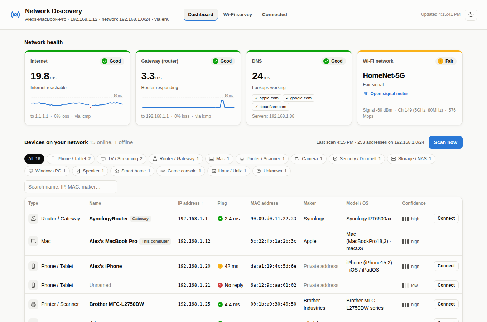
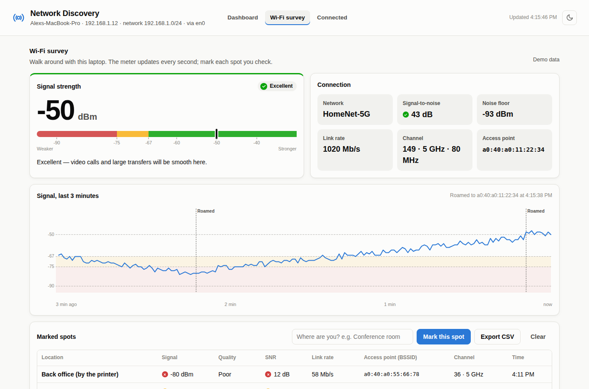
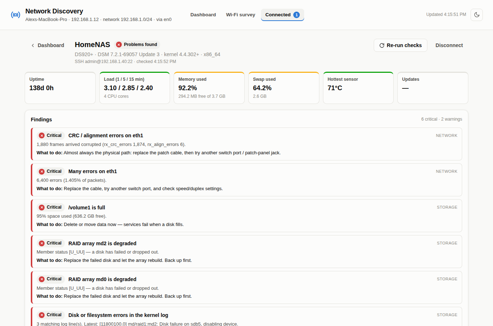
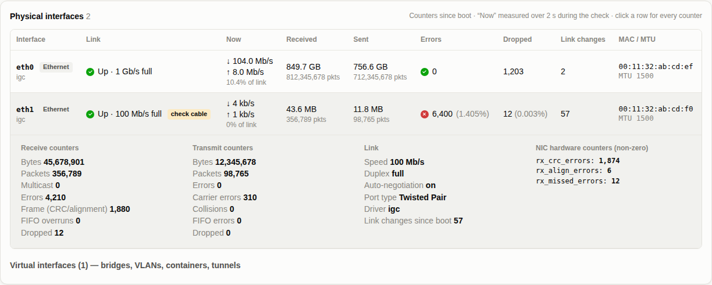

# Network Discovery

  

A lightweight network dashboard that runs on your Mac and opens in your browser. No admin rights, no cloud, one optional dependency.

- **Health checks** for internet, gateway, DNS and Wi-Fi, with red/yellow/green indicators and latency history.
- **Every device on the network**, identified as a computer, phone, printer, camera, NAS, TV and so on (from Bonjour, UPnP, NetBIOS, MAC vendor and open ports), with live ping times.
- **A Wi-Fi survey meter** (updated every second) for walking an office when complaints come in, with roaming detection, marked spots and CSV export.
- **Connect to a device** with a password and optional one-time code (2FA) for a read-only health check with suggested fixes. It covers Linux, Raspberry Pi and OpenWrt over SSH, and Synology NAS (DSM) and routers (SRM) over SSH or their web API.
- **Wi-Fi client signal strength** from access points and Synology routers.



| Wi-Fi survey | Device health report |
|---|---|
|  |  |



## Get it

```bash
git clone https://github.com/<your-account>/network-discovery.git
cd network-discovery
```

Requirements: macOS with Python 3.9+ (the Command Line Tools' `python3` is fine). Linux works for most features too. `paramiko` is only needed for SSH connections and is installed automatically by the launcher.

Try it without touching your network: `python3 -m netdisco --demo`

> **Use responsibly:** only scan networks and sign in to devices that you own or are authorized to manage.

## Run it

Double-click **`Start Network Discovery.command`**. The first time, right-click → **Open**, because macOS blocks unsigned scripts.

The first run takes about 30 seconds. It creates a private Python environment in this folder (`.venv`) and installs one package, `paramiko`, which handles SSH. Nothing is installed system-wide. If that install fails (for example, you're offline), everything except SSH connect still works.

The dashboard opens at <http://127.0.0.1:8765>. Close the Terminal window to stop it.

From Terminal: `.venv/bin/python -m netdisco`, with these options:

| Option | Default | What it does |
|---|---|---|
| `--port` | 8765 | Port the dashboard runs on |
| `--no-browser` | off | Don't open the dashboard automatically |
| `--health-interval` | 5 | Seconds between health checks |
| `--rescan` | 300 | Seconds between automatic device scans |
| `--demo` | off | Sample data for trying out the interface |

## Features in detail

### The device list follows your network

When you join a different Wi-Fi network (or subnet or router), the app clears the old list and scans the new network.

A change is detected when the SSID, subnet or router MAC address changes. If macOS briefly hides the network name, that alone doesn't count as a change. A banner tells you when the list was cleared.

### Live ping to every device

Every 5 seconds the app pings each discovered device, showing milliseconds and a traffic light:

| Status | Round-trip time |
|---|---|
| Green | Under 30 ms |
| Yellow | 30–100 ms |
| Red | Over 100 ms, or no reply |

It doesn't need admin rights (it uses the ICMP sockets macOS allows for normal users). Devices that ignore ping, such as Windows PCs with the firewall on, are timed with a TCP handshake to a port the scan found open.

### Wi-Fi survey (the **Wi-Fi survey** tab)

A large signal meter that updates every second, for walking the office when complaints come in.

- **Readings:** signal in dBm on a colour-zoned bar, signal-to-noise ratio, noise, link rate, channel and band, and the access point (BSSID) you're on.
- **Last 3 minutes chart:** marks each moment the laptop **roamed** to another access point.
- **Mark this spot:** type a location (such as "Conference room") to save the averaged reading. Export the list as CSV for a report.

Signal thresholds:

| Quality | Signal |
|---|---|
| Excellent | −60 dBm or stronger |
| Good | −60 to −67 dBm |
| Fair | −67 to −75 dBm |
| Poor | Below −75 dBm |

For SNR: 25 dB or more is good, 15–25 dB is fair, and under 15 dB is poor.

> To see the network name and access point, give Terminal Location access: System Settings → Privacy & Security → Location Services → Terminal. Then restart the app. Signal strength works either way.

### Connect & check a device

Use **Connect** on any device row. The dialog asks for the method, username, password and an optional **one-time code**. If the device asks for a code you left out, the dialog tells you and you can try again.

**SSH** works with Linux servers, Raspberry Pi, Synology NAS (DSM), OpenWrt and Synology SRM (as root). It runs one read-only script and reports:

- Uptime, load per core, memory and swap
- Disk and inode usage, and RAID state (degraded or rebuilding)
- Temperatures
- **Every physical interface** (Ethernet, Wi-Fi radios, bonds), with virtual ones (bridges, VLANs, Docker, tunnels) listed separately:
  - link state, speed, duplex, auto-negotiation, MTU, MAC, driver and firmware
  - live throughput and % of link speed (measured over 2 seconds)
  - full kernel counters: bytes, packets, multicast, errors, CRC/frame, FIFO, carrier, collisions, drops, link changes
  - non-zero NIC hardware counters from `ethtool -S` (CRC, alignment, missed…), and bond member status
  - findings for CRC errors, half duplex, 10/100 links, flapping, saturated links and failed bond members
- Kernel log problems: disk I/O errors, out-of-memory kills, lockups, crashes, under-voltage, thermal events
- journald, logread and syslog errors
- Failed services
- Pending apt/opkg updates and whether a reboot is required
- The busiest processes
- Connected Wi-Fi clients, if the device is an access point (`iw` / `iwinfo` / `wlanconfig`)

**Synology (web)** signs in the way the Synology web page does, including the 2-step verification code, and works out whether the device is a NAS (DSM) or a router (SRM). Ports: DSM 5000 (HTTP) / 5001 (HTTPS), SRM 8000 / 8001; HTTP vs HTTPS is detected automatically.

On a **NAS (DSM)** it reads model, DSM version, uptime, CPU, memory, system temperature, pending DSM updates, **every drive's status, SMART and temperature**, storage pools (degraded / crashed / repairing), volume usage, every physical port (link, speed, duplex, MTU, IP and live throughput), and the DSM log, including failed sign-ins. Error counters aren't available through the web API — connect with SSH for those.

On a **router (SRM)** it reads:

- Model, firmware and uptime
- CPU and memory use
- Whether a firmware update is available
- Mesh nodes
- Logs
- **Every connected Wi-Fi client with signal strength**, band, link rate and which mesh node it's on
- Physical ports (WAN/LAN link, speed, duplex, live throughput) where the router's API exposes them

Each report lists **findings** by severity (critical, warning, info), each with a **"What to do"** suggestion. Sessions stay open for 15 minutes so **Re-run checks** doesn't need you to sign in again.

**Security**

- Passwords and codes are used only to sign in. They're never saved or logged.
- SSH host keys are remembered after the first connection (`~/.netdisco/known_hosts`). If a device's key changes later, the app refuses to connect until you confirm the change.
- The dashboard only listens on 127.0.0.1. It rejects requests from other sites, including forged form posts and DNS rebinding.
- The SRM client can only call read-only methods.

## Known limits

- The per-second Wi-Fi reader uses Apple's CoreWLAN framework. If it can't start on your macOS version, the survey falls back to readings every few seconds (the tab says which mode it's in).
- SRM field names vary between firmware versions. If the client list comes back empty, open **Raw data** at the bottom of the report and share it so the parser can be extended.
- Some logs need root. When they can't be read, the report says so instead of guessing.

## Tests

```bash
python3 -m unittest discover -s tests -t .
```

## Layout

```
netdisco/
  server.py        local web server + JSON API
  health.py        internet / gateway / DNS / Wi-Fi checks, network-change detection
  discovery.py     sweep, ARP, ports, names; resets when the network changes
  pinger.py        per-device ping (unprivileged ICMP, TCP fallback)
  wifi_live.py     1-second Wi-Fi sampler, roaming events, marked spots
  wifi_helper.py   CoreWLAN reader (runs as its own process)
  connect/         ssh.py (paramiko, one-time codes), srm.py (Synology DSM/SRM web API),
                   linux.py (health script + analysis), manager.py (sessions), findings.py
  classify.py, oui.py, sysinfo.py, protocols/   discovery internals
  static/          dashboard UI
  demo.py          sample data for --demo
```

## Credits

- The MAC vendor database (`netdisco/oui.tsv.gz`) is derived from the public IEEE OUI registry, via the copy bundled with [netaddr](https://github.com/netaddr/netaddr) (BSD licence).
- SSH support uses [paramiko](https://www.paramiko.org/) (LGPL 2.1), installed separately into a private virtual environment.

## License

MIT (see [LICENSE](LICENSE)).
