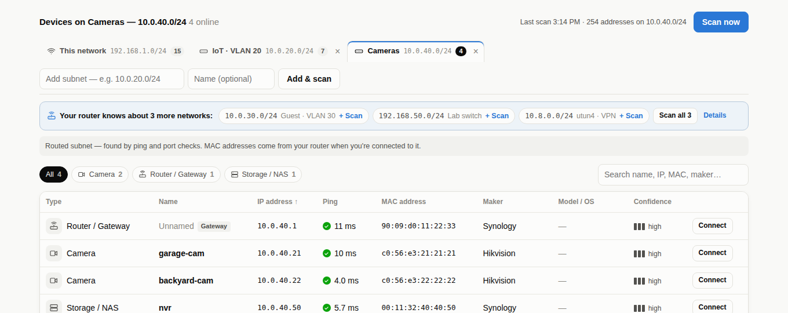
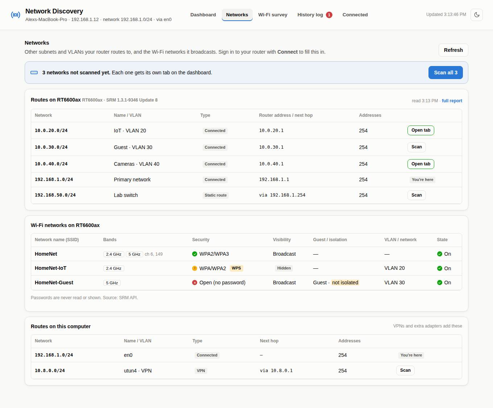
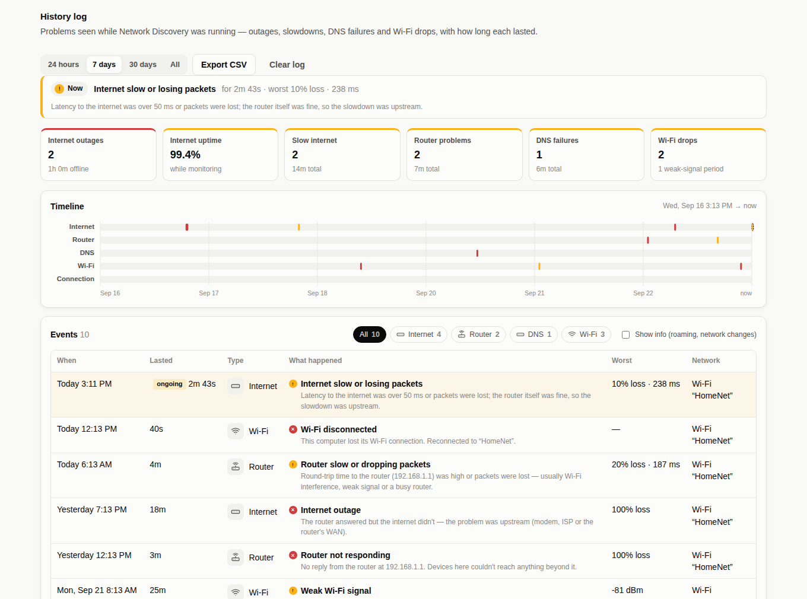

# Network Discovery

  

A lightweight network dashboard that runs on your Mac and opens in your browser. No admin rights, no cloud, one optional dependency.

- **Health checks** for internet, gateway, DNS and Wi-Fi, with red/yellow/green indicators and latency history.
- **Every device on the network**, identified as a computer, phone, printer, camera, NAS, TV and so on (from Bonjour, UPnP, NetBIOS, MAC vendor and open ports), with live ping times.
- **More subnets and VLANs, one tab each.** Type a subnet in, or pick one your router's route table knows about.
- **Your router's networks**: its route table (other subnets, VLANs, static and VPN routes) and the Wi-Fi networks (SSIDs) it broadcasts, with their security checked.
- **A history log** of internet outages, slowdowns, router and DNS problems and Wi-Fi drops, with how long each lasted.
- **A Wi-Fi survey meter** (updated every second) for walking an office when complaints come in, with roaming detection, marked spots and CSV export.
- **Connect to a device** with a password and optional one-time code (2FA) for a read-only health check with suggested fixes. It covers Linux, Raspberry Pi and OpenWrt over SSH, and Synology NAS (DSM) and routers (SRM) over SSH or their web API.
- **Wi-Fi client signal strength** from access points and Synology routers.




| Wi-Fi survey | Device health report |
|---|---|
|  |  |

| Networks (routes & SSIDs) | History log |
|---|---|
|  |  |


## Get it

```bash
git clone https://github.com/<your-account>/network-discovery.git
cd network-discovery
```

Requirements: macOS with Python 3.9+ (the Command Line Tools' `python3` is fine). Linux works for most features too. `paramiko` is only needed for SSH connections and is installed automatically by the launcher.

Try it without touching your network: `python3 -m netdisco --demo`

> **Use responsibly:** only scan networks and sign in to devices that you own or are authorized to manage.

## Run it

Double-click **`Start Network Discovery.command`**. The first time, right-click → **Open**, because macOS blocks unsigned scripts.

The first run takes about 30 seconds. It creates a private Python environment in this folder (`.venv`) and installs one package, `paramiko`, which handles SSH. Nothing is installed system-wide. If that install fails (for example, you're offline), everything except SSH connect still works.

The dashboard opens at <http://127.0.0.1:8765>. Close the Terminal window to stop it.

From Terminal: `.venv/bin/python -m netdisco`, with these options:

| Option | Default | What it does |
|---|---|---|
| `--port` | 8765 | Port the dashboard runs on |
| `--no-browser` | off | Don't open the dashboard automatically |
| `--health-interval` | 5 | Seconds between health checks |
| `--rescan` | 300 | Seconds between automatic device scans |
| `--demo` | off | Sample data for trying out the interface |

## Features in detail

### The device list follows your network

When you join a different Wi-Fi network (or subnet or router), the app clears the old list and scans the new network.

A change is detected when the SSID, subnet or router MAC address changes. If macOS briefly hides the network name, that alone doesn't count as a change. A banner tells you when the list was cleared.

### Live ping to every device

Every 5 seconds the app pings each discovered device, showing milliseconds and a traffic light:

| Status | Round-trip time |
|---|---|
| Green | Under 30 ms |
| Yellow | 30–100 ms |
| Red | Over 100 ms, or no reply |

It doesn't need admin rights (it uses the ICMP sockets macOS allows for normal users). Devices that ignore ping, such as Windows PCs with the firewall on, are timed with a TCP handshake to a port the scan found open.

### Other subnets and VLANs (tabs above the device list)

Each subnet gets its own tab. **This network** follows your computer; the others stay until you remove them (×) and are remembered between runs (`~/.netdisco/subnets.json`).

- **Add one by hand:** type it in the box next to the tabs, such as `10.0.20.0/24`, `10.0.20.0 255.255.255.0`, `10.0.20.10-60`, or several separated by commas. Only private ranges (10.x, 172.16–31.x, 192.168.x, 100.64/10) up to a /20 (4,096 addresses) can be scanned.
- **Add from your router:** once you've connected to the router, a bar under the tabs lists the networks from its route table that don't have a tab yet. Click one to scan it, or **Scan all**. VPN routes on this computer are offered too.

A subnet behind a router can't be seen with ARP or Bonjour, so those tabs use a **routed scan**: ping every address (twice), then try a few common TCP ports on the rest to find devices that ignore ping, then read open ports, Windows names and reverse DNS. MAC addresses and makers come from the router's own ARP and DHCP tables while you're connected to it. If a firewall answers for every address, the tab says so and only lists devices that reply to ping. If your computer has an address on the subnet itself (for example on a second adapter), the normal full scan is used instead.

Up to two subnets scan at once. Automatic rescans (every 5 minutes) include every tab.

### Networks (the **Networks** tab)

After you **Connect** to your router, this tab shows:

- **Routes & networks:** every subnet in the router's route table, with its VLAN (from names like `eth0.20` or the router's LAN settings), type (connected, static route, VPN, dynamic, container) and the router's address on it. Each one has a **Scan** button, or **Open tab** if you're already scanning it. Public, container and very large networks are listed but can't be scanned, and the table says why.
- **Wi-Fi networks (SSIDs):** each network name the router broadcasts, with its bands and channels, security (WPA3, WPA2, WPA, open, WEP), whether it's hidden, guest and isolation settings, VLAN and on/off state. **Passwords are never read.** Over SSH only an allow-list of settings is read, and web-API responses have anything that looks like a password or key replaced by `•••` before they're kept.
- **Routes on this computer:** extra routes your Mac has, such as a VPN.

Findings are added for open or WEP networks, old WPA/TKIP, WPS left on, guest networks that aren't isolated, and hidden SSIDs.

Where this comes from: `ip route`, `ip addr`, `uci show wireless` (OpenWrt) and `hostapd.conf` over SSH; the LAN/VLAN, static-route and Wi-Fi settings APIs on Synology SRM. SRM field names vary between versions. If something is missing, the report's **Raw data** section shows what the router returned.

### History log (the **History log** tab)

While Network Discovery is running it records problems with a start time, end time and the worst values seen:

| Logged as | When |
|---|---|
| Internet outage | No reply from the internet for 2 checks in a row (about 10 s). The entry says whether the router was still answering (so the problem was upstream: modem, ISP or WAN) or not (local network or Wi-Fi). |
| Internet slow or losing packets | Latency above 50 ms or packet loss for 3 checks in a row |
| Router not responding / slow | The same rules for the gateway |
| DNS failing / slow | Lookups failing or slow for 2–3 checks |
| Wi-Fi disconnected | Straight from the per-second Wi-Fi reader, with how long it took to reconnect |
| Weak Wi-Fi signal | Signal below −75 dBm for 2 checks |
| Not connected to any network | No active connection at all (other problems aren't logged on top of it) |
| Roamed / joined a network / monitoring started | Info entries (hidden unless you tick **Show info**) |

A problem ends after 2 good checks in a row. If the computer sleeps or the app stops, open problems are closed at the last check and marked as such, so gaps aren't counted as outages.

The tab shows what's happening now, totals for the selected range (outages and time offline, internet uptime, slow periods, router, DNS and Wi-Fi problems), a timeline, and the full list, which you can filter by type and export as CSV. The log is kept in `~/.netdisco/events.jsonl`; **Clear log** empties it.

### Wi-Fi survey (the **Wi-Fi survey** tab)

A large signal meter that updates every second, for walking the office when complaints come in.

- **Readings:** signal in dBm on a colour-zoned bar, signal-to-noise ratio, noise, link rate, channel and band, and the access point (BSSID) you're on.
- **Last 3 minutes chart:** marks each moment the laptop **roamed** to another access point.
- **Mark this spot:** type a location (such as "Conference room") to save the averaged reading. Export the list as CSV for a report.

Signal thresholds:

| Quality | Signal |
|---|---|
| Excellent | −60 dBm or stronger |
| Good | −60 to −67 dBm |
| Fair | −67 to −75 dBm |
| Poor | Below −75 dBm |

For SNR: 25 dB or more is good, 15–25 dB is fair, and under 15 dB is poor.

> To see the network name and access point, give Terminal Location access: System Settings → Privacy & Security → Location Services → Terminal. Then restart the app. Signal strength works either way.

### Connect & check a device

Use **Connect** on any device row. The dialog asks for the method, username, password and an optional **one-time code**. If the device asks for a code you left out, the dialog tells you and you can try again.

**SSH** works with Linux servers, Raspberry Pi, Synology NAS (DSM), OpenWrt and Synology SRM (as root). It runs one read-only script and reports:

- Uptime, load per core, memory and swap
- Disk and inode usage, and RAID state (degraded or rebuilding)
- Temperatures
- **Every physical interface** (Ethernet, Wi-Fi radios, bonds), with virtual ones (bridges, VLANs, Docker, tunnels) listed separately:
  - link state, speed, duplex, auto-negotiation, MTU, MAC, driver and firmware
  - live throughput and % of link speed (measured over 2 seconds)
  - full kernel counters: bytes, packets, multicast, errors, CRC/frame, FIFO, carrier, collisions, drops, link changes
  - non-zero NIC hardware counters from `ethtool -S` (CRC, alignment, missed…), and bond member status
  - findings for CRC errors, half duplex, 10/100 links, flapping, saturated links and failed bond members
- Kernel log problems: disk I/O errors, out-of-memory kills, lockups, crashes, under-voltage, thermal events
- journald, logread and syslog errors
- Failed services
- Pending apt/opkg updates and whether a reboot is required
- The busiest processes
- Connected Wi-Fi clients, if the device is an access point (`iw` / `iwinfo` / `wlanconfig`)

**Synology (web)** signs in the way the Synology web page does, including the 2-step verification code, and works out whether the device is a NAS (DSM) or a router (SRM). Ports: DSM 5000 (HTTP) / 5001 (HTTPS), SRM 8000 / 8001; HTTP vs HTTPS is detected automatically.

On a **NAS (DSM)** it reads model, DSM version, uptime, CPU, memory, system temperature, pending DSM updates, **every drive's status, SMART and temperature**, storage pools (degraded / crashed / repairing), volume usage, every physical port (link, speed, duplex, MTU, IP and live throughput), and the DSM log, including failed sign-ins. Error counters aren't available through the web API — connect with SSH for those.

On a **router (SRM)** it reads:

- Model, firmware and uptime
- CPU and memory use
- Whether a firmware update is available
- Mesh nodes
- Logs
- **Every connected Wi-Fi client with signal strength**, band, link rate and which mesh node it's on
- Physical ports (WAN/LAN link, speed, duplex, live throughput) where the router's API exposes them

Each report lists **findings** by severity (critical, warning, info), each with a **"What to do"** suggestion. Sessions stay open for 15 minutes so **Re-run checks** doesn't need you to sign in again.

**Security**

- Passwords and codes are used only to sign in. They're never saved or logged.
- SSH host keys are remembered after the first connection (`~/.netdisco/known_hosts`). If a device's key changes later, the app refuses to connect until you confirm the change.
- The dashboard only listens on 127.0.0.1. It rejects requests from other sites, including forged form posts and DNS rebinding.
- The SRM client can only call read-only methods.

## Known limits

- The per-second Wi-Fi reader uses Apple's CoreWLAN framework. If it can't start on your macOS version, the survey falls back to readings every few seconds (the tab says which mode it's in).
- SRM field names vary between firmware versions. If the client list comes back empty, open **Raw data** at the bottom of the report and share it so the parser can be extended.
- Some logs need root. When they can't be read, the report says so instead of guessing.
- Routed subnets don't show MAC addresses unless you're connected to the router that serves them. Devices that ignore both ping and the common ports won't be found on a routed subnet.
- The history log only covers time when the app is running.

## Tests

```bash
python3 -m unittest discover -s tests -t .
```

## Layout

```
netdisco/
  server.py        local web server + JSON API
  health.py        internet / gateway / DNS / Wi-Fi checks, network-change detection
  discovery.py     subnet tabs (ScanManager); local sweep + ARP, routed ping/TCP scan, ports, names
  netinfo.py       router route tables, VLANs and SSIDs (SSH + Synology SRM), password redaction
  events.py        history log: incident detection, ~/.netdisco/events.jsonl
  pinger.py        per-device ping (unprivileged ICMP, TCP fallback)
  wifi_live.py     1-second Wi-Fi sampler, roaming events, marked spots
  wifi_helper.py   CoreWLAN reader (runs as its own process)
  connect/         ssh.py (paramiko, one-time codes), srm.py (Synology DSM/SRM web API),
                   linux.py (health script + analysis), manager.py (sessions), findings.py
  classify.py, oui.py, sysinfo.py, protocols/   discovery internals
  static/          dashboard UI
  demo.py          sample data for --demo
```

## Credits

- The MAC vendor database (`netdisco/oui.tsv.gz`) is derived from the public IEEE OUI registry, via the copy bundled with [netaddr](https://github.com/netaddr/netaddr) (BSD licence).
- SSH support uses [paramiko](https://www.paramiko.org/) (LGPL 2.1), installed separately into a private virtual environment.

## License

MIT (see [LICENSE](LICENSE)).
